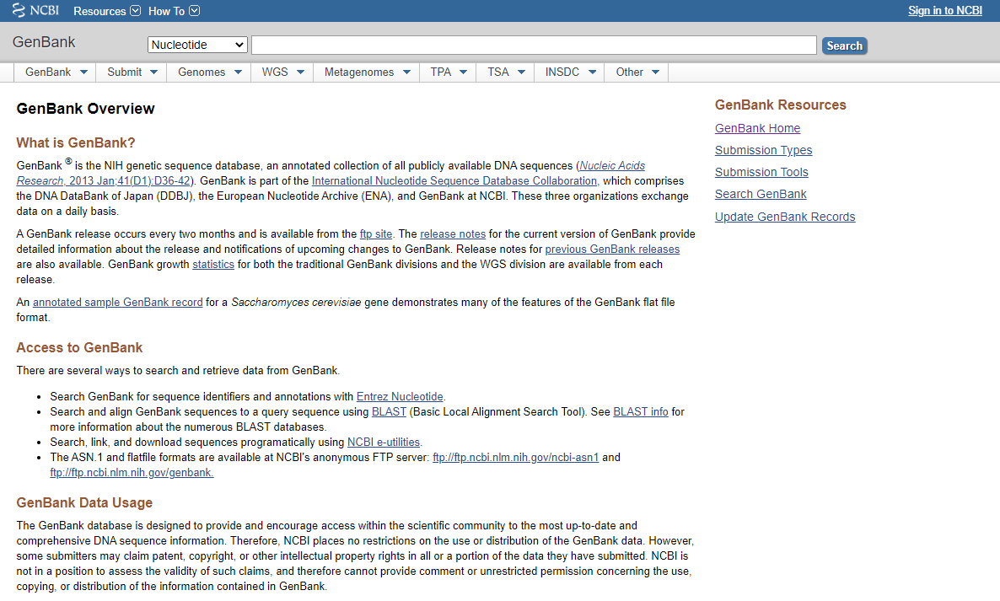
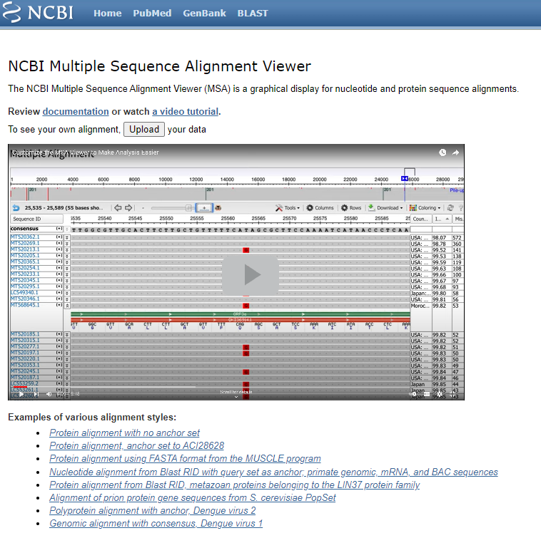

 ## Zarovnávanie sekvencií genetického kódu z [GenBank](http://ncbi.nlm.nih.gov/genbank)

 

Ak chceme pracovať biologickými sekvenčnými dátami, typicky génovými sekvenciami DNA, RNA, alebo bielkoviny, je potrebné často porovnávať jednu sekvenciu z inou, resp. ďalšími pre potreby skúmania ich evolúcie,
poťažmo mutácií.
Tu je dobré použiť párové zarovnávanie a zmyslom nasledovného python kódu je poskytnúť relevatné programové prostriedky.

